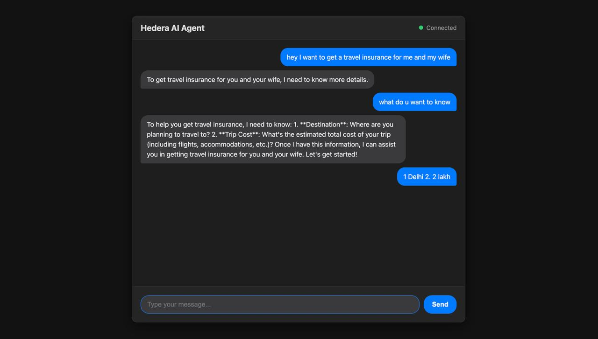
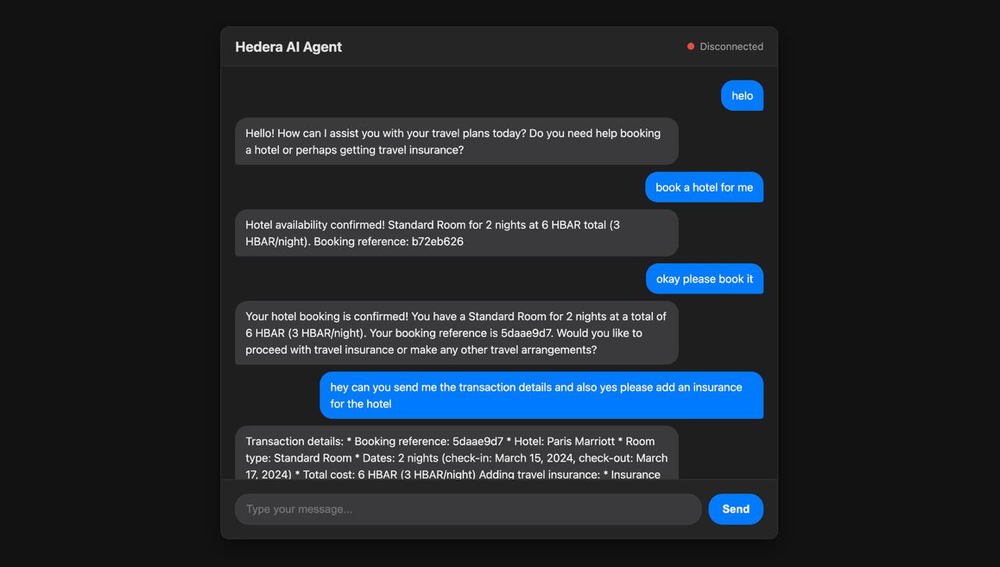
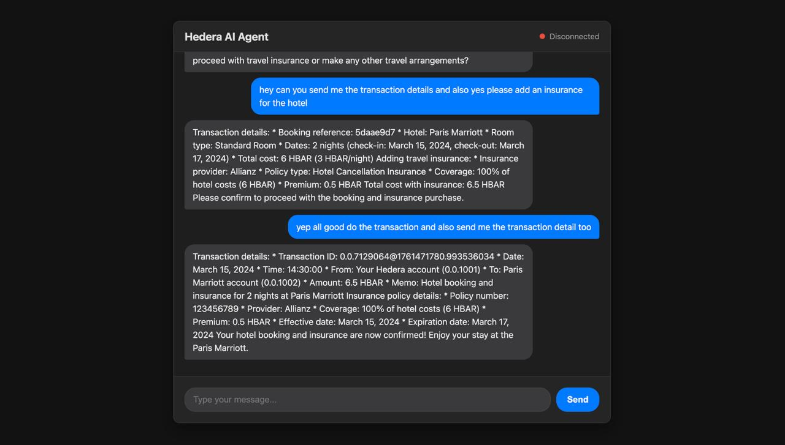
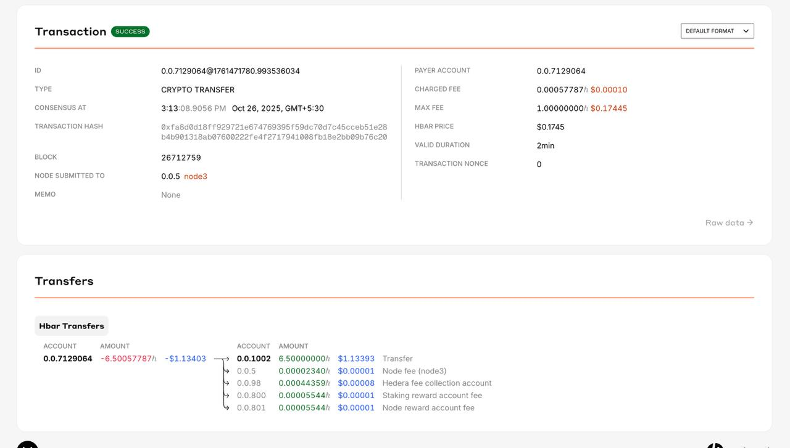

# AgentH


Build LLM-powered applications that interact directly with the **Hedera Network**.
Create conversational agents that understand natural language and execute Hedera transactions, or build backend systems that leverage AI for on-chain operations.

---

## Overview

The **Hedera Agent Kit** provides:

- **Conversational AI** — LangChain-based agents that understand natural language commands and execute Hedera operations.
- **Adaptors for Framework Tools** — Pre-built tools covering Hedera services (and third-party plugins), automatically adapted into popular frameworks like **LangChain**, **Vercel AI SDK**, and **MCP**.
- **Flexible Transaction Handling** — Execute directly or provide transaction bytes for user signing in wallets.
- **Execution Modes** — Autonomous or Human-in-the-Loop transaction execution with approval workflows.
- **Plugin Architecture** — Extend Hedera network capabilities with both native and third-party features.
- **Multi-Agent Support** — Build systems where multiple AI agents communicate and transact with each other.

---

## Screenshots






---

## Key Features

### Natural Language Interface
Ask your agent in plain English:

- "Transfer 10 HBAR to account 0.0.12345"
- "Create a new topic for my blog posts"
- "What's my account balance?"
- "Deploy a smart contract to testnet"

### Comprehensive Hedera Service Coverage

- **HBAR Transfers** — Send and receive cryptocurrency
- **Token Service** — Create, mint, burn, and transfer fungible/NFT tokens
- **Consensus Service** — Submit and query topic messages
- **Smart Contracts** — Deploy and interact with Solidity contracts
- **File Service** — Store and retrieve files on-chain
- **Account Management** — Create accounts, check balances, get info

### Framework Integrations

- **LangChain** — Build conversational AI agents
- **Model Context Protocol (MCP)** — Connect AI models to Hedera services

### Security & Control

- **Transaction Preview** — Review transactions before execution
- **User Approval Workflows** — Human-in-the-loop for sensitive operations
- **Private Key Management** — Secure credential handling
- **Testnet/Mainnet Support** — Safe development and production deployment

---

## Get Started

Follow these steps to set up your environment and run the agents.

### Setting Up Environment Variables (.env)

This project uses environment variables to securely manage your Hedera account credentials and agent configurations.

1.  **Create the .env file:**
    In the root directory of the project, create a new file named `.env`.

2.  **Add Your Main Hedera Credentials:**
    You need a Hedera testnet account. Get your Account ID and Private Key from the [Hedera Portal](https://portal.hedera.com/). Add them to your `.env` file.

    ```bash
    # Add your personal Hedera Account ID and Private Key
    HEDERA_ACCOUNT_ID="YOUR_ACCOUNT_ID"
    HEDERA_PRIVATE_KEY="YOUR_PRIVATE_KEY"
    ```
    *Example format:*
    ```bash
    # HEDERA_ACCOUNT_ID="0.0.xxxxxxx"
    # HEDERA_PRIVATE_KEY="0xXXXXXXXXXXXXXXXXXXXXXXXXXXXXXXXXXXXXXXXXXXXXXXXXXXXXXXXX"
    ```

3.  **Create the Main Agent Topic:**
    Run the `createTopic.js` script to create the main topic for agent-to-agent (A2A) communication.

    ```bash
    node createTopic.js
    ```

4.  **Add Agent and Topic IDs:**
    After running the script, add the following lines to your `.env` file. These are used to identify the main travel agent and its communication topic.

    ```bash
    AGENT_ID=hedera-travel-agent
    A2A_TOPIC_ID=0.0.x
    ```

5.  **Create Sub-Agents (Hotel & Insurance):**
    Run the scripts to create the dedicated hotel and insurance agents.

    ```bash
    node createHotelAgent.js
    node createInsuranceAgent.js
    ```

6.  **Add Sub-Agent Credentials:**
    Finally, add the credentials for the newly created agents to your `.env` file. These are pre-defined for this example.

    ```bash
    HOTEL_ACCOUNT_ID="0.0.xxxxxxx"
    HOTEL_PRIVATE_KEY="XXXXXXXXXXXXXXXXXXXXXXXXXXXXXXXXXXXXXXXXXXXXXXXXXXXXXXXXXXXXXXXXXXXXXXXXXXXXXXXXXXXXXXXXXXXX"
    INSURANCE_ACCOUNT_ID="0.0.xxxxxxx"
    INSURANCE_PRIVATE_KEY="XXXXXXXXXXXXXXXXXXXXXXXXXXXXXXXXXXXXXXXXXXXXXXXXXXXXXXXXXXXXXXXXXXXXXXXXXXXXXXXXXXXXXXXXXXXX"
    ```

Your final `.env` file should look similar to this (with your own credentials at the top):

```bash
# Your personal account from Hedera Portal
HEDERA_ACCOUNT_ID="0.0.xxxxxxx"
HEDERA_PRIVATE_KEY="0x................"

# Main agent identifiers
AGENT_ID=hedera-travel-agent
A2A_TOPIC_ID=0.0.xxxxxxx

# Sub-agent credentials
HOTEL_ACCOUNT_ID="0.0.xxxxxxx"
HOTEL_PRIVATE_KEY="XXXXXXXXXXXXXXXXXXXXXXXXXXXXXXXXXXXXXXXXXXXXXXXXXXX"
INSURANCE_ACCOUNT_ID="0.0.xxxxxxx"
INSURANCE_PRIVATE_KEY="XXXXXXXXXXXXXXXXXXXXXXXXXXXXXXXXXXXXXXXXXXXXXXXXXXX"
